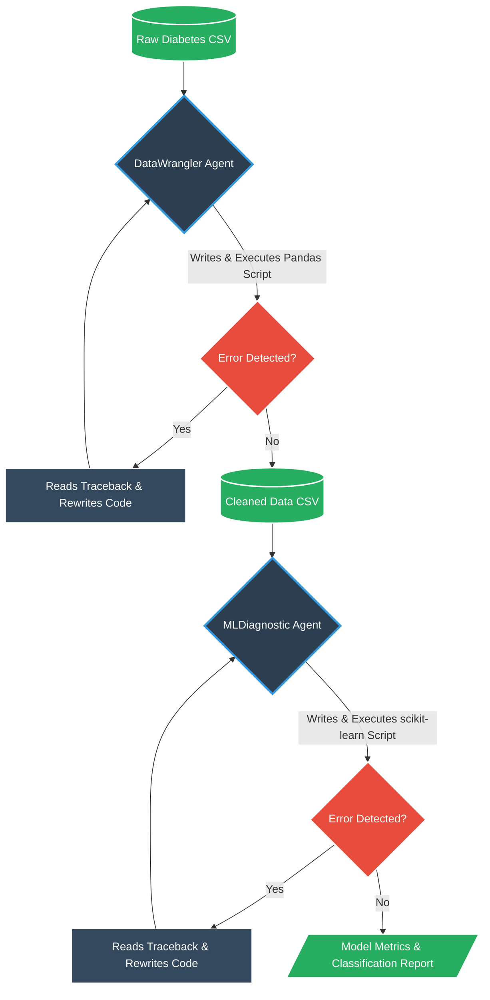

# DiaBot Analytics Forge 

**Track B: Quantitative Forge - Autonomous Data Swarm**

## The Mission
DiaBot Analytics Forge is an autonomous, self-healing data analytics swarm built with the **Agent Development Kit (ADK)** and powered by **Gemini 2.5 Flash**. 

Designed to tackle the messy reality of healthcare data, this system deploys a multi-agent swarm to handle the entire machine learning pipeline autonomously:
* **Agentic Agency & Recovery:** Agents write their own Python code, execute it in a secure environment, read their own traceback errors, and dynamically rewrite their code to recover from unexpected missing data.
* **DataWrangler Agent:** Ingests raw CSV files. Im using Pima Indian Diabetes dataset got it from kaggle and autonomously imputes or drops missing values using `pandas`.
* **MLDiagnostic Agent:** Takes the sanitized data and trains a Random Forest Classifier using `scikit-learn`, outputting real-time accuracy and classification reports.
* **Web Frontend:** A clean, interactive Streamlit UI that allows users to trigger the swarm and monitor the mission.

**Live Demo : https://diabot-forge-mh7qracs9vcgswyzes9aca.streamlit.app/ **

## System Architecture Diagram (A2A Flow)

